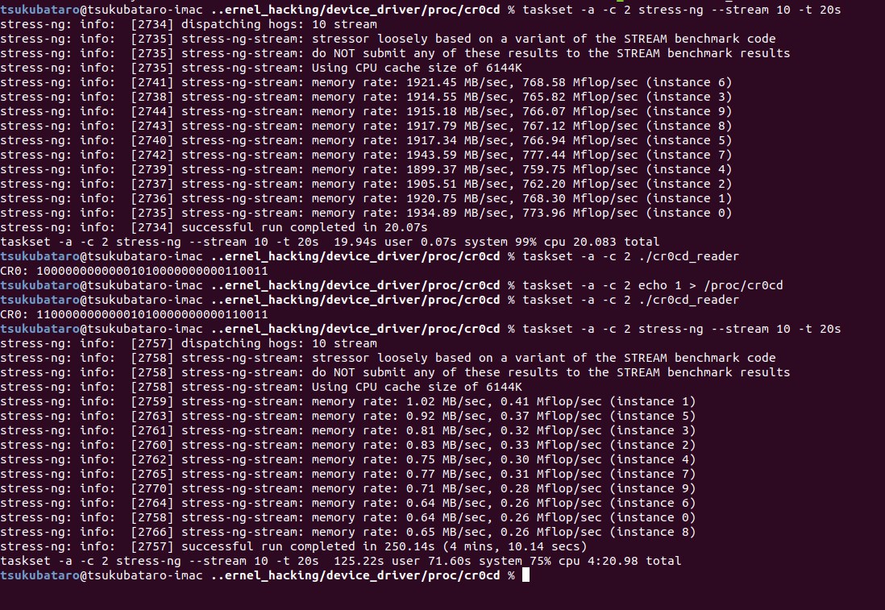

# cr0cd
CR0.CD manipulate Linux Kernel Module as a proc filesystem

## Installation
```sh
$ git clone https://github.com/alphaKAI/cr0cd
$ cd cr0cd
$ make
$ gcc -o cr0cd_reader cr0cd_reader.c
```

## Usage

CR0 exists on each of CPU core, you need specify which core will be disabled by taskset.

```
$ sudo insmod cr0cd.ko
$ taskset -c $CORE_NUMBER echo 1 > /proc/cr0cd # Disable CPU Cache
$ taskset -c $CORE_NUMBER some command # run on CPU Cache is disabled
$ taskset -c $CORE_NUMBER echo 0 > /proc/cr0cd # Enable CPU Cache
$ taskset -c $CORE_NUMBER ./cr0cd_reader # display current CR0 bits
```

## Screenshot

This is an example of how CPU Cache disable affects.  



Memory access speed down to 2GB/sec -> 1MB(or more slow).  

## LICENSE
cr0cd is released under the MIT License.  
Please see `LICENSE` for more details.  
Copyright (C) 2019 Akihiro Shoji.
